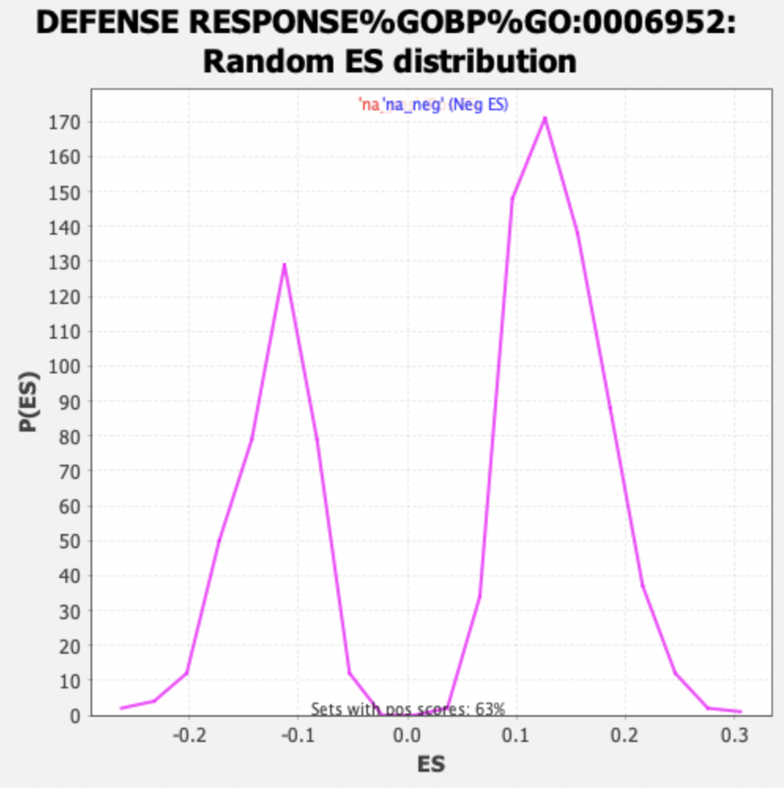
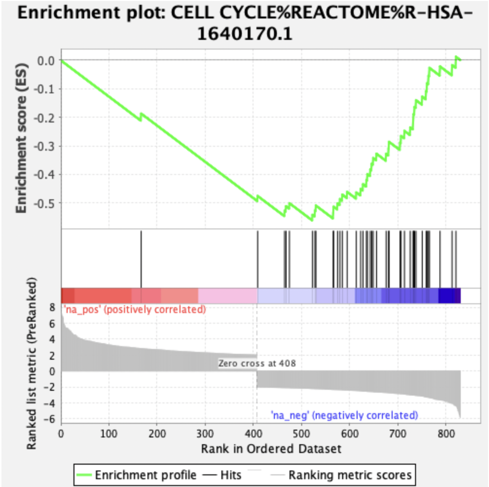
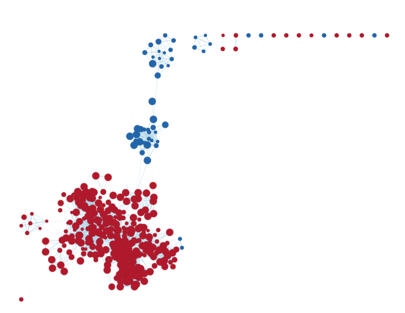
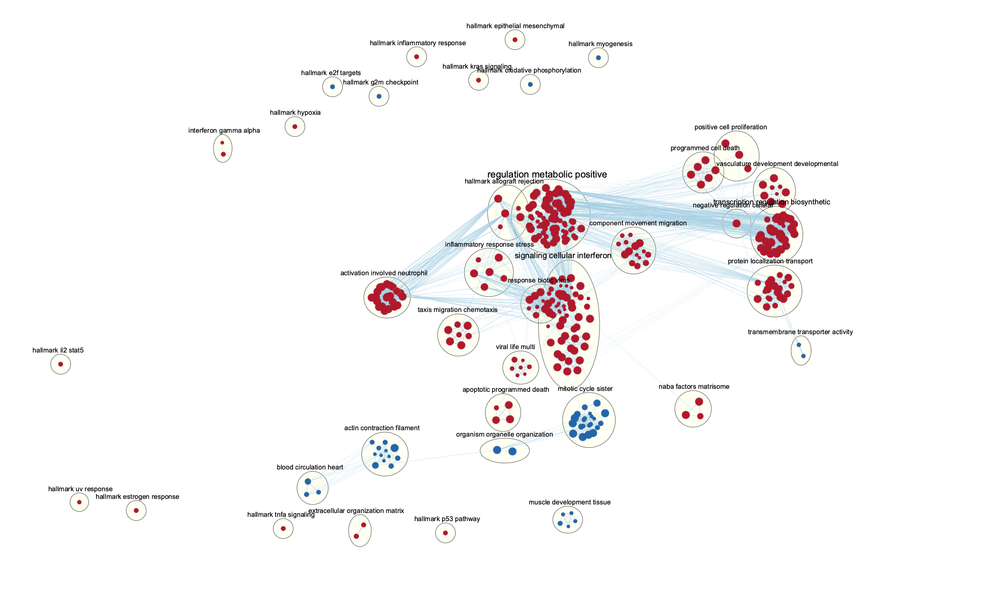

## Loading Packages and Data From A2
```{r library_loading, message=FALSE, warning=FALSE, results='hide'}

if (!require("knitr", quietly = TRUE))
  install.packages("knitr")
if (!require("RSQLite", quietly = TRUE)){
  install.packages("RSQLite")
}

library(knitr)
library(RSQLite)
load("A3.RData")
```

The ranked gene list from A2 is shown below. There are multiple parameters that can be selected. We selected to use the up-regulated rank by logFC. Original data GSE_150392 can be downloaded from https://www.ncbi.nlm.nih.gov/geo/query/acc.cgi?acc=GSE150392

```{r}
knitr::kable(MultipuleRank, caption = 'Table 1. Ranked Gene list by logFC Up-Regulated')
```

## Non-thresholded Gene Set Enrichment Analysis

Conduct non-thresholded gene set enrichment analysis using the ranked set of genes from Assignment #2.

#### 1.What method did you use? What genesets did you use? Make sure to specify versions and cite your methods.

I used GSEA4.2.3 in this part; Cytoscape 3.9.1, its Enrichment Map application and AutoAnnotation (1.3.5) application for the downstream analysis.

#### 2.Summarize your enrichment results.

```{r}
knitr::kable(ranked_gene_list_na_pos_versus_na_neg_1648855165869, caption = 'Table 2. Ranked Gene List Virus vs. Mock')
```

* 16035 gene sets with size larger than 200 or smaller than 15 were filtered out from a total of 16746, the remaining 711 gene sets were used in this analysis. We used a stricter boundary to obtain more rigorous results. We selected the permutation number of 1000, which has a suitable running time for the program.

* The Positive Phenotype (na_pos):


517 out of 711 gene sets are returned in the Virus (na_pos) sub-type. 
421 gene sets are significant at FDR < 25%.
304 gene sets are significantly enriched at nominal p-value < 1%.
366 gene sets are significantly enriched at nominal p-value < 5%.
The most related gene set in this sub-type according to the analysis is DEFENSE RESPONSE GOBP GO:0006952, with an enrichment score (ES) of 0.5994537 and a normalized enrichment score (NES) of 4.323445.




```{r}
knitr::kable(DEFENSE_RESPONSE_GOBP, caption = 'Table 4. DEFENSE RESPONSE GOBP')
```

* The Negative Phenotype (na_neg):


194 out of 711 gene sets are returned in the Mock (na_neg) sub-type. 
98 gene sets of them are significantly enriched at FDR < 25%. 
69 gene sets of them are significantly enriched at nominal p-value < 1%. 
89 gene sets of them are significantly enriched at nominal p-value < 5%.
The most related gene set in this sub-type according to the analysis is CELL CYCLE REACTOME R-HSA-1640170.1, with an enrichment score (ES) of -0.56024605 and a normalized enrichment score (NES) of -3.6521144.




```{r}
knitr::kable(CELL_CYCLE_REACTOME, caption = 'Table 6. CELL CYCLE REACTOME')
```

* However, this sample contains only 831 objects, which might be too few for the GSEA analysis.


#### 3.How do these results compare to the results from the thresholded analysis in Assignment #2. Compare qualitatively. Is this a straight forward comparison? Why or why not?

These results do not have a threshold which is a cut-off according to p-value, so the returned gene sets are slightly different. It is a straightforward comparison. Because they are both imported from the same normalized data.

## Visualize your Gene set Enrichment Analysis in Cytoscape

Visualizing the results from the non-thresholded gene set enrichment analysis in Cytoscape by Using Enrichment Map and AutoAnnotate.

#### 1. Create an enrichment map - how many nodes and how many edges in the resulting map? What thresholds were used to create this map? Make sure to record all thresholds. Include a screenshot of your network prior to manual layout.

* In the Virus vs Mock gene set enrichment map visualization, we used FDR q-value of 0.01, p-value of 0.1 and edge similarity value of 0.375 as cutoff. We selected all NES. The Metric was set to 50% Jaccard combined with 50% Overlap. There are 339 nodes and 3033 edges in this visualized enrichment map.


* Below is the over view of the network.



#### 2. Annotate your network - what parameters did you use to annotate the network. If you are using the default parameters make sure to list them as well.

* We used the default settings of the AutoAnnotate application to annotate the entire map, we selected to layout network to prevent the overlap of the clusters. We used GS_DESCR as label column. 


* We selected a round shape, border width of 3, opacity of 20%, font scale of 20% and minimum font size of 4.


#### 3. Make a publication ready figure - include this figure with proper legends in your notebook.




#### 4. Collapse your network to a theme network. What are the major themes present in this analysis? Do they fit with the model? Are there any novel pathways or themes?

* The major themes that fit with the model include blood circulation heart,actin contraction filament, organism organelle organization, mitotic cycle sister, signaling cellular interferon, apoptotic programmed death, naba factor matrisome, positive cell proliferation, response biotic virus, taxis migration chemotaxis, programmed cell death, component movement migration, hallmark allograft rejection, activation involved neutrophil, viral life multi, negative regulation cellular, regulation metabolic positive, inflammation response stress, vasculature development, protein localization transport, transcription regulation biosynthetic, transmembrane transporter activity.

* There are also novel pathways and themes that do not fit with the model: epithelial mesenchymal, myogenesis, tnfa signaling, inflammatory response, hypoxia, muscel development tissue, extracellular organization matrix, estrogen response, oxidative phosphorylation, e2f targets, p53 pathway, interferon gamma alpha, uv response, kras signaling, g2m checkpoint and il2 stat5.


## Interpretation and detailed view of results

#### 1. Do the enrichment results support conclusions or mechanism discussed in the original paper? How do these results differ from the results you got from Assignment #2 thresholded methods

Yes, the enrichment results support conclusions and mechanisms discussed in the original paper.

#### 2. Can you find evidence, i.e. publications, to support some of the results that you see. How does this evidence support your result?

Yes. The article can be found here. https://pubmed.ncbi.nlm.nih.gov/33805011/. 

## Reference

(A3_XinyiZhang.bib)
